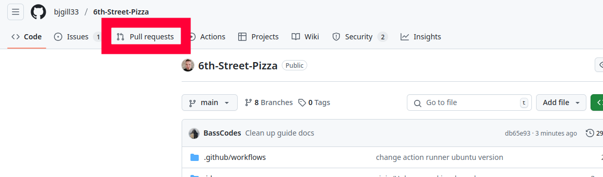
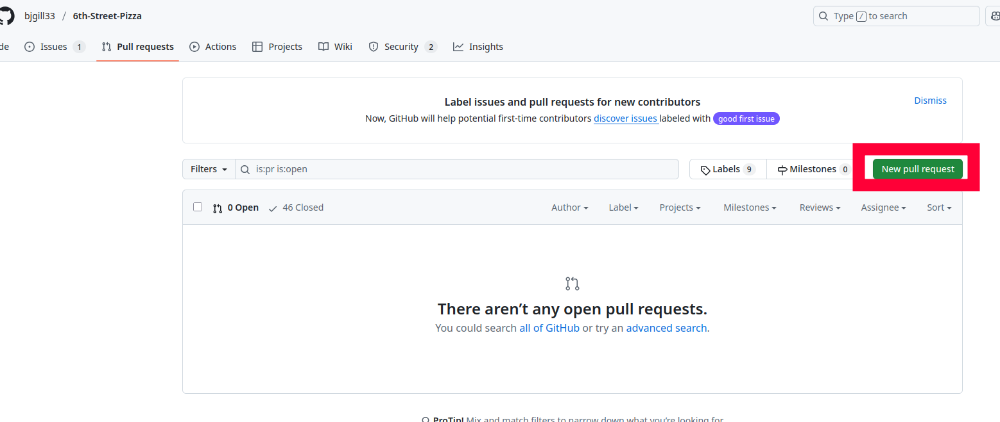
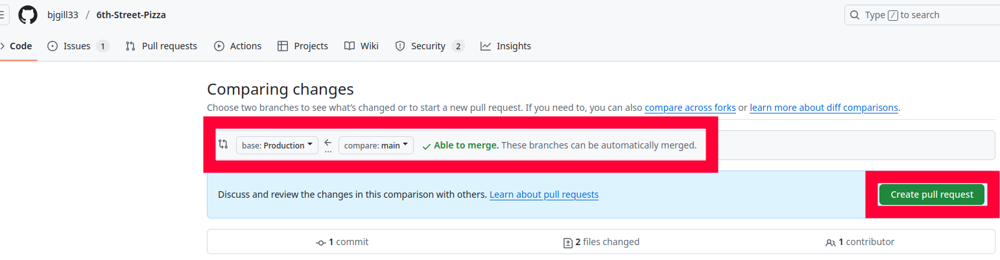
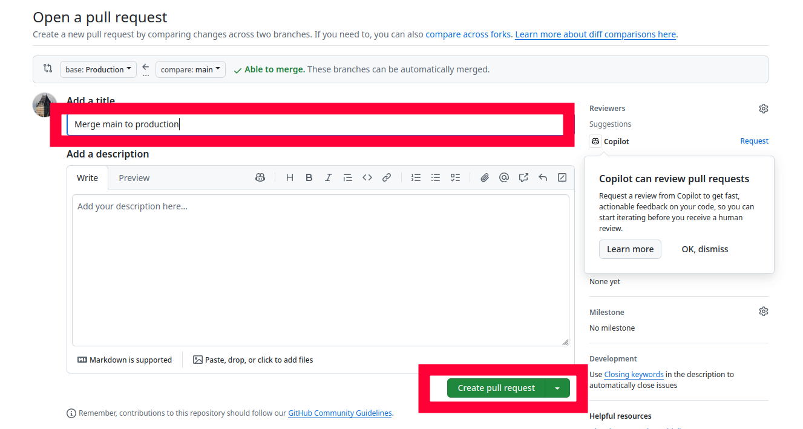
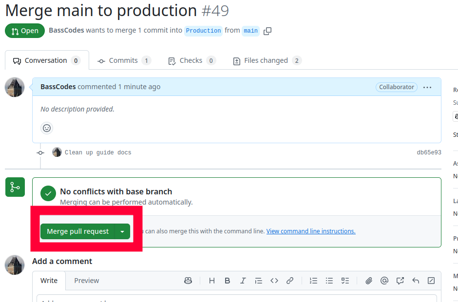

# Merging changes from the main branch to the production branch

Development should occur on the `main` branch.
When changes are to be tested on the production server, these these changes must be merged from the `main` branch, into the Production `branch`. This guide details how to merge changes from the main branch to the production branch.

## Easy Way

### Step 1

Go to the GitHub page for the project in your browser and click on "Pull Requests."



### Step 2

Click on "New pull request"



### Step 3

Set the base to `Production` and compare to `main.



NOTE: If it does not say "Able to merge. These branches can be automatically merged. Then something has gone wrong in the git repo.
(likely someone pushed to the `Production` directly instead of merging from main ).
If you're familiar enough with git to solve this yourself, go ahead.
Otherwise I (Alexander) would be glad to help fix the issue, just ping me.

Click "Create Pull Request"

### Step 4

Give your pull request a descriptive title.



Then click "Create pull request"

You should be taken to the pull request you created.

### Step 5

Again, it should say "No conflicts with base branch"

Click on merge pull request.



Click "Confirm merge"

### Finished

You are now done merging the main branch into the production branch.

## Hard Way

Prerequisites

- Git
- VSCode (or other code editor)
- Git repository setup [Cloning Repo](./cloning_repo.md)

(I wrote this before I realized it could be done natively in github. Keeping it as it still might be useful)

### Step 1

Open your editor to the 6th street pizza project.

Open a command line terminal in your editor. `CTRL+~` Should open one up in VSCode. Alternatively, any Command Prompt/Powershell/Terminal in the project directory should work.

### Step 2

Fetch changes from github

```shell
git fetch
```

### Step 3

In the terminal, run

```shell
git status
```

You should see an output like this:

```
On branch main
Your branch is up to date with 'origin/main'.

...
```

### Step 4

Change the current active branch to the production branch

```shell
git switch Production
```

Run

```shell
git status
```

Again to verify you have switched branches.
You should an output like this:

```
On branch Production
Your branch is up to date with 'origin/Production'.

nothing to commit, working tree clean
```

### Step 5

In the production branch, run

```shell
git merge main
```

This command takes all changes in the `main` branch, and merges them into the `Production` branch.

You should see something like this:

```shell
Updating 53c5e53..2b2a3e7
Fast-forward
 docs/merging_production.md | 0
 1 file changed, 0 insertions(+), 0 deletions(-)
```

NOTE: This should _hopefully_ work without issue.
If you see anything in the output about "Merge Conflicts" then something went wrong somewhere along the line.
If you're confident in your git abilities and understand the source of the conflict, you can resolve the conflict yourself.
Otherwise, feel free to contact me (Alexander) and I can help you sort it out.
No really, please do contact me; this stuff can be frustrating.

### Step 6

Now, the production branch has the same contents as the main branch, but only on your local computer.
Next, push the changes to the GitHub repository.

```shell
git push origin Production
```

### Step 7

You're now done with merging `main` into `Production`.

You can now switch back to the main branch, (or your own personal working branch).

```shell
git switch main
```
